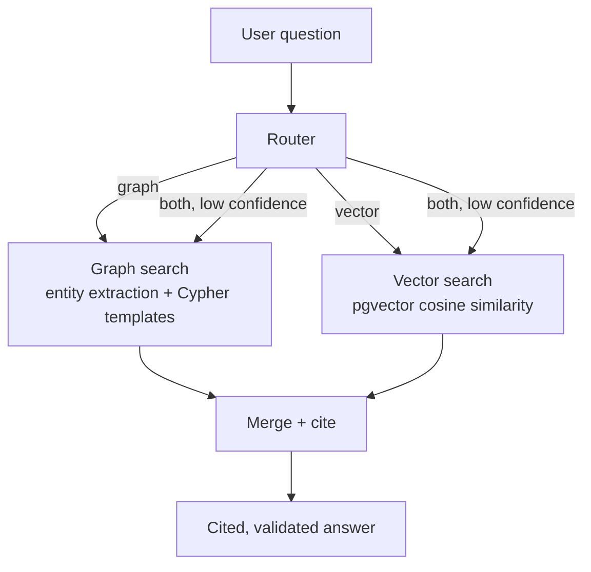
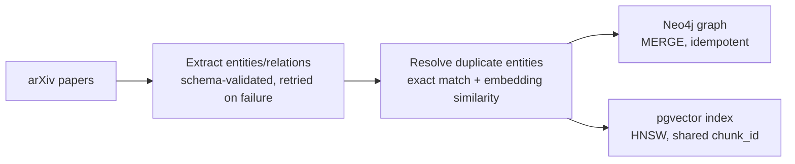

# Tessera

A hybrid knowledge graph + vector RAG system over ML/NLP research papers. Answers questions with citation-validated sources — routing multi-hop relationship questions to a Neo4j knowledge graph and single-fact questions to pgvector similarity search, then merging both into one grounded answer.

> 🚧 **Status: in active development.** Core pipeline (extraction → entity resolution → graph + vector stores → routing → citation-validated generation) is built and verified. Benchmark against a vector-only baseline is in progress.

## Why this exists

Plain vector RAG retrieves chunks that *resemble* a question semantically — it has no concept of relationships or multi-step paths. Questions like *"which papers propose methods that extend a technique used by a different author's earlier work?"* require connecting facts that never appear together in any single passage. That's a path-finding problem, not a similarity problem — which is what the graph half of this system exists to solve.

## Architecture



**Ingestion pipeline:**



## What's built

- **Schema-validated extraction** — Claude/Groq extracts entities and relationships from paper abstracts into a strict, `pydantic`-enforced ontology (6 entity types, 9 relationship types). Malformed responses are automatically retried.
- **Entity resolution** — merges duplicate entities extracted under different surface names (e.g. "RAG" and "retrieval-augmented generation") using exact-match normalization and embedding similarity, scoped so identity types (Paper, Author) are never fuzzy-merged.
- **Knowledge graph** — entities and relationships written into Neo4j with `MERGE`, making ingestion idempotent and safe to re-run.
- **Vector index** — paper abstracts embedded and indexed in Postgres via pgvector (HNSW), sharing a `chunk_id` key with the graph so results can be cross-referenced between stores.
- **Query router** — a few-shot-prompted LLM call classifies each question as needing graph traversal, vector search, or both, with a confidence threshold that defaults to running both paths when uncertain.
- **Graph search** — extracts the entity in question and selects from a fixed library of Cypher query templates (never freeform, model-generated Cypher); resolves the extracted name to a real graph node via substring and embedding matching.
- **Citation-validated generation** — merges graph and vector context into one labeled prompt, requires a citation per claim, and programmatically verifies every citation the model used actually exists in the retrieved context — rejecting and regenerating otherwise.

## In progress

- Benchmark comparing this system against a vector-only baseline across single-hop, two-hop, three-hop, and aggregation questions
- FastAPI endpoint wrapping the pipeline
- Expanding the corpus beyond the current ~20-paper development set

## Tech stack

Python · Neo4j · pgvector (Postgres) · sentence-transformers · Groq (Llama) / Claude API — swappable via a single provider-agnostic wrapper · FastAPI (in progress)

## Project structure

```
tessera/
├── docker-compose.yml       # Neo4j + Postgres, local dev
├── src/
│   ├── llm.py                # provider-agnostic LLM wrapper
│   ├── ingest/
│   │   ├── fetch_papers.py       # pulls papers from arXiv's API
│   │   ├── schema.py             # entity/relation ontology (pydantic)
│   │   ├── extract.py            # LLM extraction, schema validation, retries
│   │   ├── resolve_entities.py   # duplicate entity merging
│   │   ├── write_graph.py        # writes into Neo4j (MERGE)
│   │   └── build_vector_index.py # embeds + indexes into pgvector
│   ├── retrieval/
│   │   ├── router.py             # graph / vector / both classifier
│   │   ├── vector_search.py      # pgvector similarity search
│   │   └── graph_search.py       # entity resolution + Cypher templates
│   └── generation/
│       └── merge.py              # merges context, generates + validates citations
├── data/                     # pipeline outputs (raw, extracted, resolved)
└── LEARNING_LOG.md           # per-file build notes and concepts
```

## Ontology

**Entities:** Paper, Author, Institution, Method, Dataset, Task

**Relationships:** `AUTHORED_BY`, `AFFILIATED_WITH`, `CITES`, `PROPOSES`, `USES_METHOD`, `EVALUATED_ON`, `ADDRESSES`, `EXTENDS`, `APPLIED_TO`

## Running it locally

```bash
docker compose up -d              # start Neo4j + Postgres
pip install -r requirements.txt
# populate .env with your LLM API key and DB credentials — see .env.example

python3 -m src.ingest.fetch_papers
python3 -m src.ingest.extract
python3 -m src.ingest.resolve_entities
python3 -m src.ingest.write_graph
python3 -m src.ingest.build_vector_index

python3 -m src.generation.merge    # try it out
```

## Example

```
Q: Who else works on statute retrieval besides the LegalMALR authors?
Route: graph

The authors of 'NOWJ@COLIEE 2026: Adaptive Pipelines for Legal Retrieval
and Reasoning' also work on statute retrieval, besides the LegalMALR
authors [G1].
```

This is a genuine 3-hop connection (Author → Paper → Task ← Paper ← Author) between two papers with no overlapping authors — the kind of fact a vector-only system would likely miss, since no single passage states it directly.
